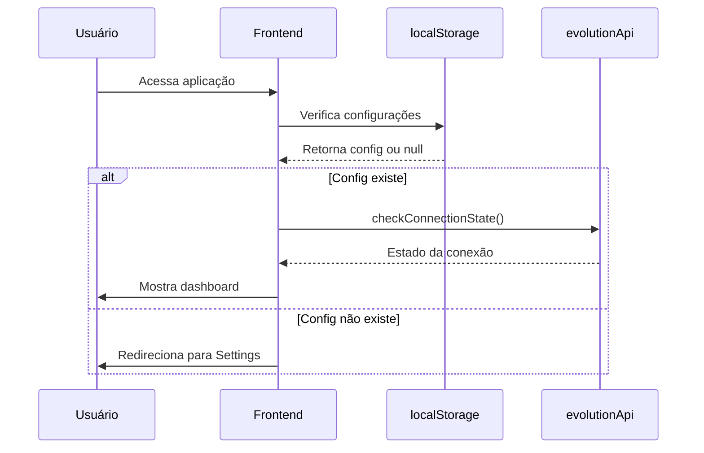
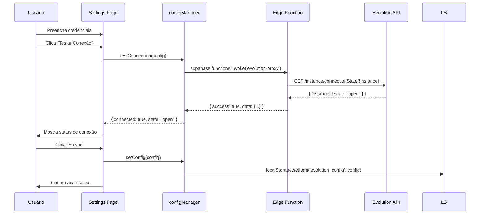
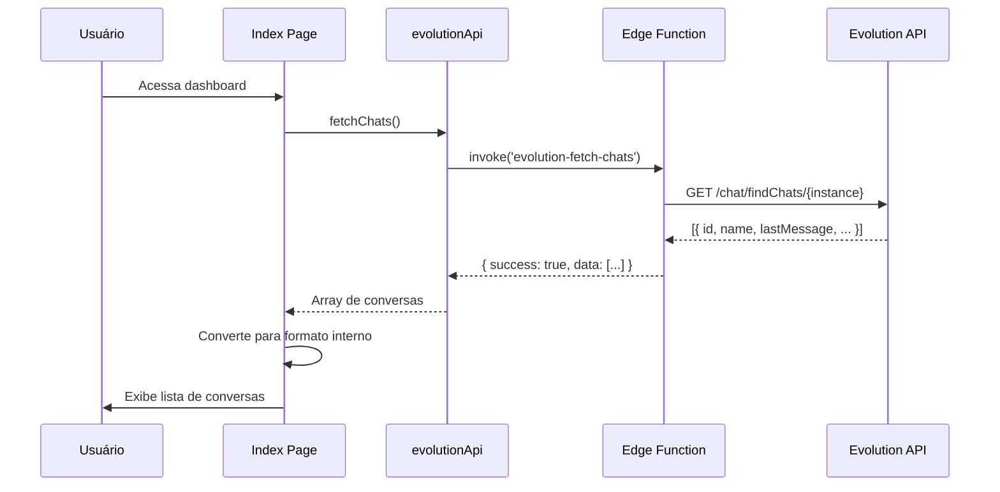
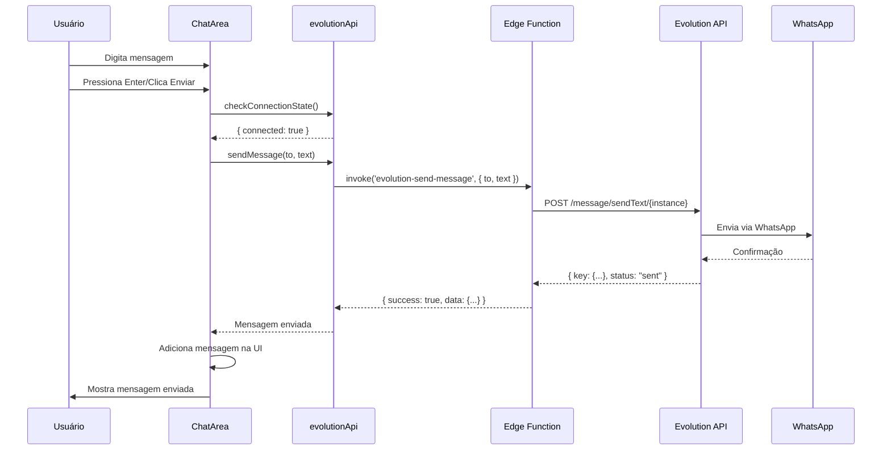

# 🏗 Arquitetura do Projeto

Este documento detalha a arquitetura técnica do WhatsApp Dashboard, explicando como todos os componentes funcionam juntos.

## 📐 Visão Geral

O projeto segue uma arquitetura **client-server com proxy intermediário**, utilizando Edge Functions como camada de segurança e abstração.

```
┌─────────────────────────────────────────────────────────────────┐
│                           FRONTEND                               │
│                         (React + Vite)                           │
│                                                                   │
│  ┌─────────────────┐  ┌──────────────────┐  ┌────────────────┐ │
│  │  Pages          │  │  Components       │  │  Library       │ │
│  │                 │  │                   │  │                │ │
│  │  - Index        │  │  - ChatArea       │  │  - API Client  │ │
│  │  - Settings     │  │  - ConvList       │  │  - Config      │ │
│  │  - NotFound     │  │  - MsgBubble      │  │  - Storage     │ │
│  └─────────────────┘  └──────────────────┘  └────────────────┘ │
│                                │                                 │
│                                │                                 │
│                         ┌──────▼──────┐                         │
│                         │ evolutionApi │                         │
│                         │   Client     │                         │
│                         └──────┬──────┘                         │
└────────────────────────────────┼──────────────────────────────┘
                                 │
                                 │ HTTPS
                                 │
┌────────────────────────────────▼──────────────────────────────┐
│                      BACKEND MIDDLEWARE                        │
│                   (Supabase Edge Functions)                    │
│                                                                 │
│  ┌──────────────────────────────────────────────────────────┐ │
│  │  evolution-proxy/                                         │ │
│  │    → Proxy genérico para qualquer endpoint               │ │
│  │    → Valida credenciais                                   │ │
│  │    → Adiciona headers de autenticação                     │ │
│  └──────────────────────────────────────────────────────────┘ │
│                                                                 │
│  ┌──────────────────────────────────────────────────────────┐ │
│  │  evolution-fetch-chats/                                   │ │
│  │    → Busca lista de conversas                            │ │
│  │    → Formata resposta                                     │ │
│  └──────────────────────────────────────────────────────────┘ │
│                                                                 │
│  ┌──────────────────────────────────────────────────────────┐ │
│  │  evolution-fetch-messages/                                │ │
│  │    → Busca mensagens de uma conversa                     │ │
│  │    → Filtra e formata dados                               │ │
│  └──────────────────────────────────────────────────────────┘ │
│                                                                 │
│  ┌──────────────────────────────────────────────────────────┐ │
│  │  evolution-send-message/                                  │ │
│  │    → Envia mensagens de texto                            │ │
│  │    → Valida número de telefone                            │ │
│  └──────────────────────────────────────────────────────────┘ │
└────────────────────────────────────────────────────────────────┘
                                 │
                                 │ HTTP/HTTPS
                                 │
┌────────────────────────────────▼──────────────────────────────┐
│                      EVOLUTION API SERVER                      │
│                                                                 │
│  ┌──────────────────────────────────────────────────────────┐ │
│  │  WhatsApp Business API                                    │ │
│  │    → Gerencia instâncias                                  │ │
│  │    → Mantém conexão com WhatsApp                         │ │
│  │    → Envia/Recebe mensagens                              │ │
│  │    → Webhooks e eventos                                   │ │
│  └──────────────────────────────────────────────────────────┘ │
└────────────────────────────────────────────────────────────────┘
```

## 🔄 Fluxo de Dados

### 1. Inicialização da Aplicação



### 2. Configuração de Credenciais



### 3. Carregamento de Conversas



### 4. Envio de Mensagem



## 🔐 Camada de Segurança

### Por que usar Edge Functions?

1. **Proteção de Credenciais**
   - API Key nunca é exposta no frontend
   - Credenciais trafegam apenas do localStorage para Edge Function
   - Edge Function adiciona headers de autenticação

2. **Resolução de CORS/Mixed Content**
   - Frontend (HTTPS) → Edge Function (HTTPS) ✅
   - Edge Function (HTTPS) → Evolution API (HTTP/HTTPS) ✅
   - Evita: Frontend (HTTPS) → Evolution API (HTTP) ❌

3. **Camada de Validação**
   - Edge Functions validam inputs antes de repassar
   - Podem adicionar rate limiting
   - Logs centralizados para debug

### Fluxo de Autenticação

```
┌─────────────┐
│  Frontend   │
│             │
│ [localStorage] ← Credenciais salvas localmente
│     │         │
│     ▼         │
│ evolutionApi  │
└──────┬────────┘
       │
       │ { apiUrl, apiKey, instance, endpoint, body }
       │
       ▼
┌─────────────────────┐
│   Edge Function     │
│                     │
│ 1. Recebe request   │
│ 2. Extrai params    │
│ 3. Valida inputs    │
│ 4. Monta URL final  │
│ 5. Adiciona headers │
│    - apikey         │
│    - content-type   │
│ 6. Faz request      │
│ 7. Retorna response │
└──────┬──────────────┘
       │
       │ Authorization: apikey {API_KEY}
       │
       ▼
┌─────────────────────┐
│  Evolution API      │
│                     │
│ 1. Valida API Key   │
│ 2. Valida instance  │
│ 3. Processa request │
│ 4. Retorna response │
└─────────────────────┘
```

## 📦 Estrutura de Módulos

### Frontend

```
src/
├── components/           # Componentes React reutilizáveis
│   ├── ChatArea.tsx             # [Smart] Gerencia chat ativo
│   ├── ConversationItem.tsx     # [Dumb] Item da lista
│   ├── ConversationList.tsx     # [Smart] Lista de conversas
│   ├── Header.tsx               # [Dumb] Cabeçalho
│   ├── MessageBubble.tsx        # [Dumb] Bolha de mensagem
│   └── ui/                      # Componentes Shadcn (design system)
│
├── pages/                # Páginas da aplicação (rotas)
│   ├── Index.tsx                # Dashboard principal
│   ├── Settings.tsx             # Configurações
│   └── NotFound.tsx             # 404
│
├── lib/                  # Lógica de negócio e utilitários
│   ├── evolutionApi.ts          # [API Client] Interface com Evolution
│   ├── config.ts                # [Config] Gerencia credenciais
│   ├── storage.ts               # [Storage] Helpers localStorage
│   ├── mockData.ts              # [Mock] Dados de demonstração
│   ├── dateUtils.ts             # [Utils] Formatação de datas
│   └── utils.ts                 # [Utils] Funções auxiliares
│
└── integrations/         # Integrações externas
    └── supabase/
        ├── client.ts            # Cliente Supabase
        └── types.ts             # Tipos TypeScript auto-gerados
```

### Backend (Edge Functions)

```
supabase/
├── functions/
│   ├── evolution-proxy/
│   │   └── index.ts             # Proxy genérico e flexível
│   │
│   ├── evolution-fetch-chats/
│   │   └── index.ts             # Endpoint específico: listar chats
│   │
│   ├── evolution-fetch-messages/
│   │   └── index.ts             # Endpoint específico: mensagens
│   │
│   └── evolution-send-message/
│       └── index.ts             # Endpoint específico: enviar msg
│
└── config.toml                  # Configuração Supabase
```

## 🧩 Componentes Principais

### 1. evolutionApi.ts (API Client)

**Responsabilidade**: Interface única para comunicação com Evolution API

```typescript
interface EvolutionApiClient {
  // Estado
  checkConnectionState(): Promise<ConnectionState>
  
  // Conversas
  fetchChats(): Promise<Chat[]>
  fetchMessages(remoteJid: string): Promise<Message[]>
  
  // Mensagens
  sendMessage(to: string, text: string): Promise<SendResult>
}
```

**Funcionamento**:
1. Lê configurações do `configManager`
2. Faz chamadas para Edge Functions via `supabase.functions.invoke()`
3. Trata erros e retorna dados formatados
4. Não expõe detalhes da implementação

### 2. configManager (Config)

**Responsabilidade**: Gerenciar credenciais e testar conexão

```typescript
interface ConfigManager {
  // CRUD de config
  getConfig(): EvolutionConfig | null
  setConfig(config: EvolutionConfig): void
  clearConfig(): void
  isConfigured(): boolean
  
  // Teste de conexão
  testConnection(config: EvolutionConfig): Promise<TestResult>
}
```

**Funcionamento**:
1. Usa `localStorage` para persistir credenciais
2. Valida formato de inputs (URL, campos obrigatórios)
3. Testa conexão real com Evolution API
4. Retorna status detalhado (API OK, WhatsApp conectado/desconectado)

### 3. Index Page (Dashboard)

**Responsabilidade**: Orquestrar carregamento e exibição de dados

```typescript
interface IndexState {
  conversations: Conversation[]
  activeConversationId: string | null
  messages: Message[]
  isLoadingChats: boolean
  isLoadingMessages: boolean
  connectionState: ConnectionState
  dataSource: 'real' | 'mock'
}
```

**Funcionamento**:
1. Carrega conversas na montagem (`useEffect`)
2. Verifica conexão periodicamente
3. Alterna entre dados reais e mock
4. Gerencia estado global do dashboard
5. Passa callbacks para componentes filhos

### 4. ChatArea Component

**Responsabilidade**: Interface de chat (mensagens + input)

```typescript
interface ChatAreaProps {
  conversation: Conversation | null
  messages: Message[]
  onSendMessage: (text: string) => Promise<void>
  connectionState: ConnectionState
  onCheckConnection: () => Promise<void>
}
```

**Funcionamento**:
1. Exibe mensagens em ordem cronológica
2. Auto-scroll para última mensagem
3. Input de texto com botão de envio
4. Valida conexão antes de enviar
5. Mostra indicadores visuais de status
6. Bloqueia envio quando desconectado

### 5. Edge Functions

**Estrutura Comum**:

```typescript
// Todas seguem este padrão
Deno.serve(async (req) => {
  // 1. Headers CORS
  const corsHeaders = {
    'Access-Control-Allow-Origin': '*',
    'Access-Control-Allow-Headers': '...',
  }
  
  // 2. Handle OPTIONS (CORS preflight)
  if (req.method === 'OPTIONS') {
    return new Response(null, { headers: corsHeaders })
  }
  
  try {
    // 3. Parse body
    const { apiUrl, apiKey, instance, ...params } = await req.json()
    
    // 4. Validações
    if (!apiUrl || !apiKey || !instance) {
      throw new Error('Missing required parameters')
    }
    
    // 5. Request para Evolution API
    const response = await fetch(`${apiUrl}/endpoint/${instance}`, {
      headers: {
        'apikey': apiKey,
        'Content-Type': 'application/json',
      },
      body: JSON.stringify(params),
    })
    
    // 6. Parse response
    const data = await response.json()
    
    // 7. Return success
    return new Response(
      JSON.stringify({ success: true, data }),
      { headers: { ...corsHeaders, 'Content-Type': 'application/json' } }
    )
    
  } catch (error) {
    // 8. Handle errors
    return new Response(
      JSON.stringify({ success: false, error: error.message }),
      { 
        status: 500,
        headers: { ...corsHeaders, 'Content-Type': 'application/json' }
      }
    )
  }
})
```

## 🔄 Estados e Sincronização

### Estado de Conexão

```typescript
interface ConnectionState {
  connected: boolean    // WhatsApp está conectado?
  state: string        // Estado da instância (open, close, connecting)
  lastChecked: Date    // Última verificação
}
```

**Verificação**:
- Inicial: Ao carregar dashboard
- Manual: Clique no ícone de status
- Automática: Antes de enviar mensagem

### Estado de Conversas

```typescript
interface Conversation {
  id: string
  remoteJid: string    // ID único do WhatsApp
  name: string
  avatar?: string
  lastMessage: string
  timestamp: Date
  unreadCount: number
}
```

**Sincronização**:
- Carrega ao abrir dashboard
- Atualiza após enviar mensagem
- Pode ser atualizado manualmente (refresh)

### Estado de Mensagens

```typescript
interface Message {
  id: string
  conversationId: string
  text: string
  timestamp: Date
  sender: 'me' | 'them'
  status: 'sent' | 'delivered' | 'read'
}
```

**Sincronização**:
- Carrega ao selecionar conversa
- Adiciona localmente após enviar (otimista)
- Pode ser atualizado manualmente

## 🚀 Performance

### Otimizações Implementadas

1. **Lazy Loading de Mensagens**
   - Mensagens carregam só quando conversa é selecionada
   - Reduz dados iniciais

2. **Cache Local**
   - Configurações em `localStorage`
   - Evita requisições repetidas

3. **Modo Mock**
   - Permite testar sem API
   - Útil para desenvolvimento

### Oportunidades de Melhoria

1. **Paginação**
   - Carregar conversas em lotes
   - Scroll infinito para mensagens antigas

2. **Real-time**
   - WebSocket ou Polling para novas mensagens
   - Notificações de mensagens recebidas

3. **Cache Inteligente**
   - Cache de conversas e mensagens
   - Invalidação automática
   - Service Worker para offline

4. **Debouncing**
   - Busca de conversas com delay
   - Reduz requisições durante digitação

## 🔍 Debug e Logs

### Logs no Frontend

```typescript
// evolutionApi.ts
console.log('📤 Sending request:', { endpoint, params })
console.log('📥 Response received:', data)
console.error('❌ Error:', error)

// config.ts
console.log('🔧 Testing connection:', { apiUrl, instance })
console.log('✅ Connection OK:', result)
console.error('❌ Connection failed:', error)
```

### Logs nas Edge Functions

```typescript
console.log('📨 Request received:', {
  method: req.method,
  endpoint,
  hasAuth: !!apiKey,
})

console.log('➡️ Forwarding to Evolution API:', url)
console.log('✅ Success:', { status, data })
console.error('❌ Error:', error.message)
```

### Como Debugar

1. **Frontend**:
   - Abra DevTools (F12)
   - Console: Veja logs do cliente
   - Network: Veja requisições HTTP
   - Application → localStorage: Veja config salva

2. **Edge Functions**:
   - Lovable: Backend → Edge Functions → Logs
   - Replit: Console/Shell mostra logs em tempo real

3. **Evolution API**:
   - Logs do container/servidor
   - Interface web do Evolution (se disponível)

## 📚 Referências

- [Evolution API Docs](https://doc.evolution-api.com/)
- [Supabase Edge Functions](https://supabase.com/docs/guides/functions)
- [React Best Practices](https://react.dev/learn)
- [TypeScript Handbook](https://www.typescriptlang.org/docs/)

---

**Documentação mantida com ❤️ pelo time de desenvolvimento**
