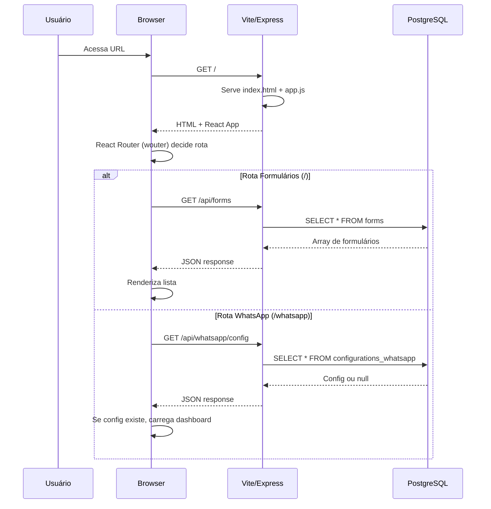
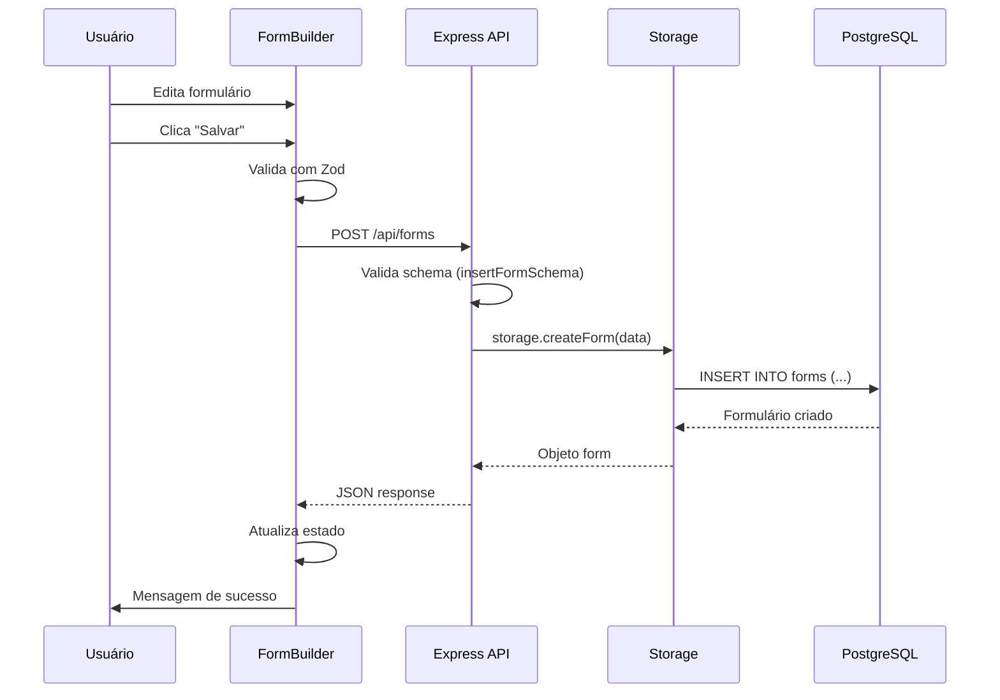
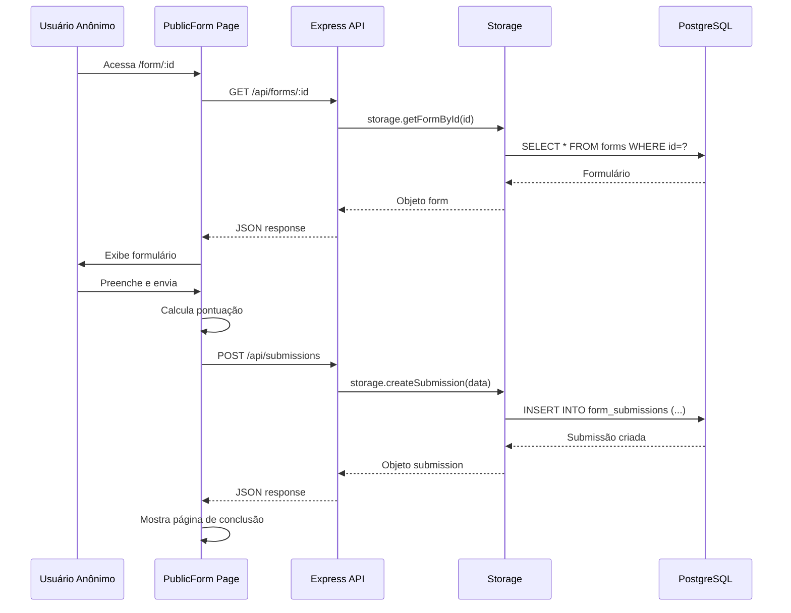
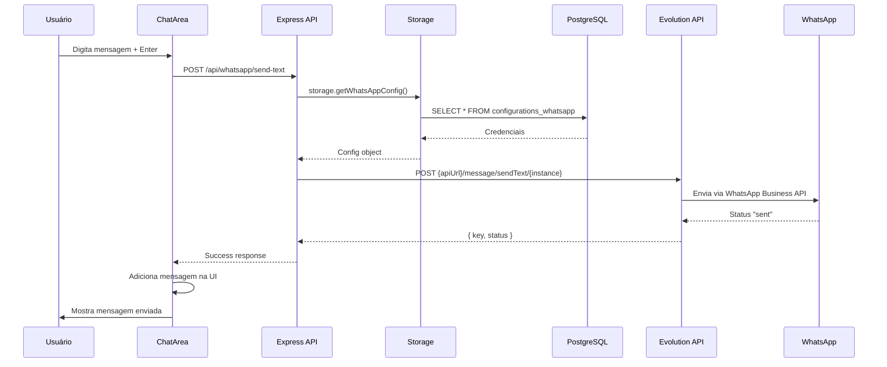

# 🏗️ Arquitetura do Sistema - Plataforma Dual

## 📐 Visão Geral da Arquitetura

O projeto segue uma arquitetura **monolítica modular** com duas plataformas integradas:

```
┌─────────────────────────────────────────────────────────────────────┐
│                          CLIENTE (Browser)                           │
│                                                                       │
│  ┌────────────────────────┐         ┌──────────────────────────┐   │
│  │  Plataforma Formulários│         │  Plataforma WhatsApp      │   │
│  │  (client/src/)         │         │  (whatsapp-platform/)     │   │
│  │                         │         │                           │   │
│  │  - 9 páginas           │         │  - 2 páginas              │   │
│  │  - 67 componentes      │         │  - 11 componentes         │   │
│  │  - Wouter routing      │         │  - Wouter routing         │   │
│  └────────────┬───────────┘         └──────────┬────────────────┘   │
└───────────────┼────────────────────────────────┼────────────────────┘
                │                                 │
                │  HTTP/HTTPS (REST)              │
                │                                 │
┌───────────────▼─────────────────────────────────▼────────────────────┐
│                    SERVIDOR EXPRESS (Node.js)                        │
│                                                                       │
│  ┌──────────────────┐    ┌─────────────────┐    ┌────────────────┐ │
│  │  Vite Middleware │    │  Static Assets  │    │  API Routes    │ │
│  │  (dev mode)      │    │  (prod mode)    │    │  (routes.ts)   │ │
│  └──────────────────┘    └─────────────────┘    └────────┬───────┘ │
│                                                            │         │
│  ┌─────────────────────────────────────────────────────────▼─────┐ │
│  │  Storage Layer (storage.ts)                                    │ │
│  │  - getForms(), createForm(), updateForm(), deleteForm()       │ │
│  │  - getSubmissions(), createSubmission()                        │ │
│  │  - getWhatsAppConfig(), saveWhatsAppConfig()                  │ │
│  │  - testWhatsAppConnection()                                    │ │
│  └─────────────────────────────┬───────────────────────────────────┘ │
└─────────────────────────────────┼─────────────────────────────────────┘
                                  │
                                  │  Drizzle ORM
                                  │
┌─────────────────────────────────▼─────────────────────────────────────┐
│                       BANCO DE DADOS PostgreSQL                        │
│                                                                         │
│  ┌──────────────────────────────────────────────────────────────────┐ │
│  │  Tabelas Formulários:                                             │ │
│  │  • forms (formulários)                                            │ │
│  │  • form_submissions (respostas)                                   │ │
│  │  • completion_pages (páginas finais)                              │ │
│  │  • form_templates (templates)                                     │ │
│  │  • app_settings (config Supabase)                                 │ │
│  └──────────────────────────────────────────────────────────────────┘ │
│                                                                         │
│  ┌──────────────────────────────────────────────────────────────────┐ │
│  │  Tabelas WhatsApp:                                                │ │
│  │  • configurations_whatsapp (credenciais Evolution API)            │ │
│  └──────────────────────────────────────────────────────────────────┘ │
└─────────────────────────────────────────────────────────────────────────┘

                                  │
                                  │  HTTP (outbound)
                                  │
┌─────────────────────────────────▼─────────────────────────────────────┐
│                       EVOLUTION API (Externo)                           │
│                                                                         │
│  • Gerencia instâncias WhatsApp                                        │
│  • Envia/recebe mensagens                                              │
│  • Upload de mídia                                                     │
│  • Webhooks                                                            │
└─────────────────────────────────────────────────────────────────────────┘
```

---

## 🔄 Fluxo de Dados

### 1. Carregamento Inicial da Aplicação



### 2. Criação de Formulário



### 3. Submissão Pública de Formulário



### 4. Envio de Mensagem WhatsApp



---

## 🧩 Componentes Principais

### Frontend

#### 1. App.tsx (Router Principal)

```typescript
// Responsabilidades:
// - Roteamento global usando wouter
// - Carrega providers (QueryClient, SupabaseConfig, Tooltip)
// - Define rotas para ambas as plataformas

<Switch>
  <Route path="/form/:id" component={PublicForm} />
  <Route path="/whatsapp/:rest*">
    <WhatsApp />  {/* Carrega plataforma WhatsApp completa */}
  </Route>
  <Route path="/whatsapp">
    <WhatsApp />
  </Route>
  <Route path="/configuracoes">
    <Configuracoes />
  </Route>
  <Route>
    <FormularioLayout>
      {/* Rotas da plataforma de formulários */}
    </FormularioLayout>
  </Route>
</Switch>
```

#### 2. whatsapp-platform/App.tsx (Sub-Router)

```typescript
// Responsabilidades:
// - Roteamento interno da plataforma WhatsApp
// - Gerencia rotas /whatsapp e /whatsapp/settings

<Router base="/whatsapp">
  <Switch>
    <Route path="/settings" component={Settings} />
    <Route path="/" component={Index} />
    <Route component={NotFound} />
  </Switch>
</Router>
```

#### 3. FormBuilderWithDesign.tsx

```typescript
// Responsabilidades:
// - Gerencia estado do formulário em criação/edição
// - Integra 3 abas: Perguntas | Design | Templates
// - Drag-and-drop para ordenar perguntas
// - Preview em tempo real
// - Salva no backend via API

interface FormBuilderState {
  questions: Question[]
  designConfig: DesignConfig
  title: string
  description: string
  passingScore: number
  scoreTiers: ScoreTier[]
}
```

#### 4. whatsapp-platform/components/ChatArea.tsx

```typescript
// Responsabilidades:
// - Interface de chat (mensagens + input)
// - Renderiza mensagens com MessageBubble
// - Envia texto, imagens, áudios, vídeos
// - Auto-scroll para última mensagem
// - Indicadores de conexão e status

interface ChatAreaProps {
  conversation: Conversation | null
  messages: Message[]
  onSendMessage: (text: string) => Promise<void>
  onRefreshMessages: () => void
}
```

### Backend

#### 1. server/index.ts (Servidor Principal)

```typescript
// Responsabilidades:
// - Inicializa Express
// - Configura middlewares (json, cors)
// - Registra rotas via registerRoutes()
// - Serve Vite em dev / static em prod
// - Inicia servidor na porta 5000

const app = express();
app.use(express.json());
registerRoutes(app);

if (process.env.NODE_ENV === "production") {
  serveStatic(app);
} else {
  setupVite(app, server);
}

server.listen(5000);
```

#### 2. server/routes.ts (Rotas da API)

```typescript
// Responsabilidades:
// - Define TODAS as rotas (Forms + WhatsApp)
// - Valida inputs com Zod schemas
// - Chama storage layer
// - Suporta dual-database (PostgreSQL + Supabase)
// - Tratamento de erros

export function registerRoutes(app: Express) {
  // Forms routes (12 endpoints)
  app.get("/api/forms", ...);
  app.post("/api/forms", ...);
  // ...
  
  // WhatsApp routes (11 endpoints)
  app.get("/api/whatsapp/config", ...);
  app.post("/api/whatsapp/send-text", ...);
  // ...
}
```

#### 3. server/storage.ts (Camada de Dados)

```typescript
// Responsabilidades:
// - Abstrai acesso ao banco de dados
// - Implementa TODAS as operações CRUD
// - Usa Drizzle ORM
// - Métodos para Forms E WhatsApp

class DatabaseStorage {
  // Forms
  async getForms(): Promise<Form[]>
  async createForm(data: InsertForm): Promise<Form>
  async updateForm(id: string, data: Partial<Form>): Promise<Form>
  async deleteForm(id: string): Promise<void>
  
  // WhatsApp
  async getWhatsAppConfig(): Promise<ConfigurationWhatsapp | null>
  async saveWhatsAppConfig(data: InsertConfigurationWhatsapp)
  async testWhatsAppConnection(config): Promise<TestResult>
}
```

---

## 🗄️ Arquitetura do Banco de Dados

### Relacionamentos

```
forms (1) ──────┐
                │ (1:N CASCADE)
                ▼
          form_submissions (N)

forms (1) ──────┐
                │ (1:1 SET NULL)
                ▼
          completion_pages (1)
```

### Estratégia de Queries

**Otimizações:**
- Índices em `created_at` para ordenação
- Índices em FKs para joins rápidos
- `CASCADE DELETE` em submissions (se form deletado, submissions vão junto)
- `SET NULL` em completion_page (se página deletada, form mantém)

**Padrões:**
```typescript
// Lista com ordenação
const forms = await db.select()
  .from(forms)
  .orderBy(desc(forms.createdAt));

// Busca com join
const formWithSubmissions = await db.select()
  .from(forms)
  .leftJoin(formSubmissions, eq(forms.id, formSubmissions.formId))
  .where(eq(forms.id, formId));
```

---

## 🔐 Segurança

### Validação de Inputs

```typescript
// Todas as requisições validadas com Zod
import { insertFormSchema } from "@shared/schema";

app.post("/api/forms", async (req, res) => {
  const validatedData = insertFormSchema.parse(req.body);
  // Se parse() falha, lança exceção (ZodError)
});
```

### Upload de Arquivos

```typescript
// Multer com restrições
const upload = multer({
  storage: diskStorage,
  limits: { fileSize: 5 * 1024 * 1024 },  // 5MB max
  fileFilter: (req, file, cb) => {
    if (file.mimetype.startsWith('image/')) {
      cb(null, true);
    } else {
      cb(new Error('Only images allowed'));
    }
  }
});
```

### Credenciais Evolution API

```typescript
// Armazenadas em PostgreSQL (não expostas ao cliente)
// Cliente envia credenciais apenas em /api/whatsapp/config
// Servidor armazena e usa internamente
```

---

## 🚀 Performance

### Frontend

**Code Splitting:**
- Componentes WhatsApp carregados sob demanda
- Componentes UI (shadcn) tree-shaken automaticamente

**React Query Cache:**
```typescript
// Cache de 5 minutos para formulários
useQuery({
  queryKey: ['forms'],
  queryFn: fetchForms,
  staleTime: 5 * 60 * 1000
});
```

**Lazy Loading:**
- Mensagens WhatsApp carregadas ao selecionar conversa
- Imagens carregadas com lazy loading

### Backend

**Database Connection Pooling:**
```typescript
// Drizzle + Neon usa pooling automático
import { neon } from '@neondatabase/serverless';
const sql = neon(DATABASE_URL);
```

**Static Assets:**
```typescript
// Em produção, Vite build gera assets otimizados
// Express serve com cache headers
```

---

## 🔄 Dual Database Support

### Estratégia

```typescript
// Header-based routing
const supabaseUrl = req.headers['x-supabase-url'];
const supabaseKey = req.headers['x-supabase-key'];

if (supabaseUrl && supabaseKey) {
  // Usa Supabase
  const supabase = createClient(supabaseUrl, supabaseKey);
  const { data } = await supabase.from('forms').select();
  return res.json(data);
}

// Fallback: PostgreSQL local
const forms = await storage.getForms();
res.json(forms);
```

### Conversão de Nomenclatura

```typescript
// Supabase usa snake_case, frontend usa camelCase
import { convertKeysToCamelCase, convertKeysToSnakeCase } from './utils';

// Input: { createdAt, designConfig }
const snakeData = convertKeysToSnakeCase(data);
// Output: { created_at, design_config }

const { data } = await supabase.from('forms').insert(snakeData);

const camelData = convertKeysToCamelCase(data);
// Output: { createdAt, designConfig }
res.json(camelData);
```

---

## 📦 Estrutura de Módulos

### Dependências Críticas

**Frontend:**
- `wouter` - Roteamento (mais leve que react-router)
- `@tanstack/react-query` - Cache e estado assíncrono
- `react-hook-form` + `zod` - Formulários com validação
- `@dnd-kit` - Drag-and-drop
- `@radix-ui/*` - Componentes acessíveis (base do shadcn)

**Backend:**
- `express` - Servidor HTTP
- `drizzle-orm` - ORM type-safe
- `@neondatabase/serverless` - Driver PostgreSQL
- `multer` - Upload de arquivos
- `ws` - WebSocket (preparado para real-time)

---

## 🔮 Extensibilidade Futura

### WebSocket para Real-time

```typescript
// Preparado em server/index.ts
import { WebSocketServer } from 'ws';
const wss = new WebSocketServer({ server });

// Possíveis usos:
// - Notificações de novas submissões
// - Atualização de status WhatsApp em tempo real
// - Colaboração multi-usuário em formulários
```

### Autenticação

```typescript
// Estrutura pronta para adicionar:
// - JWT authentication middleware
// - User management (tabela users)
// - Role-based access control
// - Multi-tenant support (organizações)
```

### Webhooks Evolution API

```typescript
// Endpoint preparado para receber webhooks:
app.post("/webhooks/evolution", async (req, res) => {
  const event = req.body;
  // Processar nova mensagem
  // Atualizar status de entrega
  // Sincronizar conversas
});
```

---

## 📊 Diagramas de Arquitetura

### Estrutura de Pastas (Simplificada)

```
src/
├── Frontend Formulários
│   ├── pages/          # 9 páginas
│   ├── components/     # 67 componentes
│   └── lib/            # Utilitários
│
├── Frontend WhatsApp
│   ├── whatsapp-platform/
│   │   ├── pages/      # 2 páginas
│   │   ├── components/ # 11 componentes
│   │   └── lib/        # API client
│
└── Shared
    └── types/          # TypeScript types

server/
├── index.ts            # Servidor Express
├── routes.ts           # API endpoints (23 rotas)
├── storage.ts          # Database layer
└── db.ts               # PostgreSQL connection

shared/
└── schema.ts           # Drizzle schema (6 tabelas)
```

---

**Documentação mantida com ❤️ | Última atualização: 24 de outubro de 2025**
