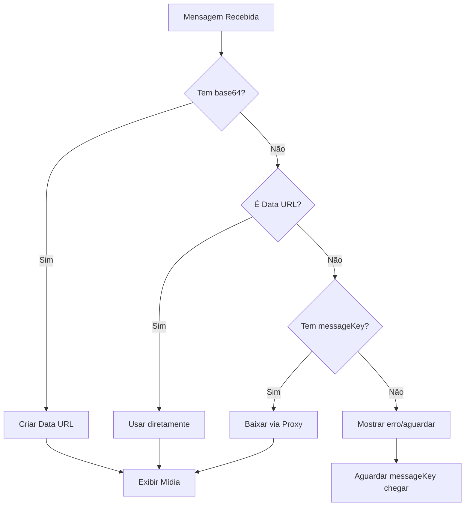

# Guia Completo do Sistema de Mídia - WhatsApp Integration

## 📋 Índice
1. [Visão Geral da Arquitetura](#visão-geral-da-arquitetura)
2. [Fluxo de Envio de Mídia](#fluxo-de-envio-de-mídia)
3. [Fluxo de Recebimento de Mídia](#fluxo-de-recebimento-de-mídia)
4. [Componentes Principais](#componentes-principais)
5. [Edge Functions](#edge-functions)
6. [Processamento de Mensagens](#processamento-de-mensagens)
7. [Sistema de Fallback](#sistema-de-fallback)
8. [Troubleshooting](#troubleshooting)

---

## 🏗️ Visão Geral da Arquitetura

### Tipos de Mídia Suportados
- **Áudio**: OGG, MP3 (mensagens de voz e áudios)
- **Imagem**: JPEG, PNG, GIF, WEBP
- **Vídeo**: MP4
- **Documento**: PDF, DOC, DOCX, XLS, XLSX, TXT

### Estrutura de Dados de Mensagem
```typescript
interface Message {
  id: string;
  texto: string;
  tipo: "recebida" | "enviada";
  enviadaPor: "cliente" | "ia" | "atendente";
  timestamp: string;
  conversationId: string;
  mediaType?: "audio" | "image" | "video" | "document";
  mediaUrl?: string;           // URL da mídia (fallback)
  mediaBase64?: string;         // Base64 da mídia (PRIORIDADE)
  caption?: string;             // Legenda da mídia
  messageKey?: any;             // Key para baixar mídia via proxy
}
```

### Princípio FUNDAMENTAL: Sistema de Prioridade Base64

**SEMPRE seguir esta ordem de prioridade:**
1. **Base64 direto** (`mediaBase64`) - Mais rápido, sem latência
2. **Data URL** (`data:image/jpeg;base64,...`) - Formato já pronto
3. **Proxy de Mídia** (via `messageKey`) - Download sob demanda
4. **URL direta** (`mediaUrl`) - Último recurso

---

## 📤 Fluxo de Envio de Mídia

### 1. Componentes de Envio

#### MediaSender Component (`src/components/MediaSender.tsx`)
```typescript
// Estrutura do componente
interface MediaSenderProps {
  onSendMedia: (mediaData: {
    mediatype: 'image' | 'video' | 'document';
    mimetype: string;
    media: string;        // Base64 SEM prefixo
    caption?: string;
    fileName?: string;
  }) => Promise<void>;
  disabled?: boolean;
}
```

**Fluxo de Envio de Imagem/Vídeo/Documento:**
1. Usuário seleciona arquivo via botão
2. Arquivo é validado (max 16MB)
3. Preview é gerado (se imagem/vídeo)
4. Usuário adiciona legenda (opcional)
5. Arquivo é convertido para base64
6. Base64 é enviado via `onSendMedia`

**Conversão para Base64:**
```typescript
const fileToBase64 = (file: File): Promise<string> => {
  return new Promise((resolve, reject) => {
    const reader = new FileReader();
    reader.onloadend = () => {
      const result = reader.result as string;
      // REMOVER o prefixo "data:image/png;base64,"
      const base64 = result.split(',')[1];
      resolve(base64);
    };
    reader.onerror = reject;
    reader.readAsDataURL(file);
  });
};
```

#### AudioRecorder Component (`src/components/AudioRecorder.tsx`)
```typescript
interface AudioRecorderProps {
  onSendAudio: (audioBlob: Blob) => Promise<void>;
  disabled?: boolean;
}
```

**Fluxo de Gravação de Áudio:**
1. Usuário clica no botão de microfone
2. Permissão de microfone é solicitada
3. MediaRecorder inicia gravação (formato: `audio/webm;codecs=opus`)
4. Timer mostra tempo de gravação
5. Usuário para gravação
6. Blob de áudio é convertido e enviado

**Conversão de Áudio:**
```typescript
// No Index.tsx - handleSendAudio
const handleSendAudio = async (audioBlob: Blob) => {
  // Converter Blob para base64
  const reader = new FileReader();
  reader.onloadend = async () => {
    const base64 = (reader.result as string).split(',')[1];
    
    // Enviar via Evolution API
    await supabase.functions.invoke('evolution-send-audio', {
      body: {
        apiUrl: config.apiUrl,
        apiKey: config.apiKey,
        instance: config.instance,
        number: remoteJid,
        audio: base64,
        encoding: true  // Base64 encoding
      }
    });
  };
  reader.readAsDataURL(audioBlob);
};
```

### 2. Edge Functions de Envio

#### evolution-send-media (`supabase/functions/evolution-send-media/index.ts`)
```typescript
// Endpoint: /message/sendMedia/{instance}
// Payload:
{
  "number": "5511999999999",
  "mediatype": "image",    // ou "video" ou "document"
  "mimetype": "image/jpeg",
  "media": "BASE64_SEM_PREFIXO",
  "caption": "Legenda opcional",
  "fileName": "arquivo.jpg"
}
```

#### evolution-send-audio (`supabase/functions/evolution-send-audio/index.ts`)
```typescript
// Endpoint: /message/sendWhatsAppAudio/{instance}
// Payload:
{
  "number": "5511999999999",
  "audio": "BASE64_SEM_PREFIXO",
  "encoding": true  // SEMPRE true para base64
}
```

---

## 📥 Fluxo de Recebimento de Mídia

### 1. Busca de Mensagens

#### evolution-fetch-messages Edge Function
```typescript
// Endpoint: /chat/findMessages/{instance}
// Payload:
{
  "where": {
    "key": {
      "remoteJid": "5511999999999@s.whatsapp.net"
    }
  }
}

// Response estrutura:
{
  "key": {
    "id": "MESSAGE_ID",
    "remoteJid": "5511999999999@s.whatsapp.net",
    "fromMe": false
  },
  "message": {
    // Para TEXTO:
    "conversation": "Texto da mensagem",
    
    // Para ÁUDIO:
    "audioMessage": {
      "url": "https://...",
      "seconds": 10,
      "ptt": true,
      "mimetype": "audio/ogg"
    },
    "base64": "BASE64_DO_AUDIO",  // IMPORTANTE!
    
    // Para IMAGEM:
    "imageMessage": {
      "url": "https://...",
      "caption": "Legenda",
      "mimetype": "image/jpeg"
    },
    "base64": "BASE64_DA_IMAGEM",  // IMPORTANTE!
    
    // Para VÍDEO:
    "videoMessage": {
      "url": "https://...",
      "caption": "Legenda",
      "mimetype": "video/mp4"
    },
    "base64": "BASE64_DO_VIDEO",
    
    // Para DOCUMENTO:
    "documentMessage": {
      "url": "https://...",
      "fileName": "arquivo.pdf",
      "mimetype": "application/pdf"
    },
    "base64": "BASE64_DO_DOCUMENTO"
  },
  "messageType": "audioMessage",  // ou "imageMessage", etc
  "messageTimestamp": 1234567890
}
```

### 2. Processamento de Mensagens Recebidas

#### Função convertEvolutionMessage (`src/pages/Index.tsx`)

**Lógica de Conversão:**
```typescript
const convertEvolutionMessage = (msg: any, conversationId: string): Message => {
  let mediaType: "audio" | "image" | "video" | "document" | undefined;
  let mediaUrl: string | undefined;
  let caption: string | undefined;
  let mediaBase64: string | undefined;
  let text = '';

  if (msg.message) {
    // ÁUDIO
    if (msg.message.audioMessage || msg.messageType === 'audioMessage') {
      mediaType = "audio";
      
      // PRIORIDADE: base64 direto no objeto
      if (msg.message.base64) {
        mediaBase64 = msg.message.base64;  // ✅ MAIS RÁPIDO
      } else if (msg.message.audioMessage) {
        mediaUrl = msg.message.audioMessage.url;  // Fallback
      }
      text = '🎤 Áudio';
    }
    
    // IMAGEM
    else if (msg.message.imageMessage || msg.messageType === 'imageMessage') {
      mediaType = "image";
      
      if (msg.message.base64) {
        mediaBase64 = msg.message.base64;  // ✅ MAIS RÁPIDO
      } else if (msg.message.imageMessage) {
        mediaUrl = msg.message.imageMessage.url;  // Fallback
      }
      caption = msg.message.imageMessage?.caption;
      text = caption || '🖼️ Imagem';
    }
    
    // VÍDEO
    else if (msg.message.videoMessage || msg.messageType === 'videoMessage') {
      mediaType = "video";
      
      if (msg.message.base64) {
        mediaBase64 = msg.message.base64;
      } else if (msg.message.videoMessage) {
        mediaUrl = msg.message.videoMessage.url;
      }
      caption = msg.message.videoMessage?.caption;
      text = caption || '🎥 Vídeo';
    }
    
    // DOCUMENTO
    else if (msg.message.documentMessage || msg.messageType === 'documentMessage') {
      mediaType = "document";
      
      if (msg.message.base64) {
        mediaBase64 = msg.message.base64;
      } else if (msg.message.documentMessage) {
        mediaUrl = msg.message.documentMessage.url;
      }
      caption = msg.message.documentMessage?.caption;
      text = caption || `📄 ${msg.message.documentMessage?.fileName || 'Documento'}`;
    }
  }
  
  return {
    id: msg.key.id,
    conversationId,
    texto: text,
    tipo: msg.key.fromMe ? "enviada" : "recebida",
    enviadaPor: msg.key.fromMe ? "atendente" : "cliente",
    timestamp: new Date(msg.messageTimestamp * 1000).toISOString(),
    mediaType,
    mediaUrl: mediaBase64 ? undefined : mediaUrl,  // Se tem base64, não usa URL
    mediaBase64,  // Base64 direto
    caption,
    messageKey: mediaType ? msg.key : undefined  // Para fallback proxy
  };
};
```

---

## 🎨 Componentes de Exibição de Mídia

### 1. AudioPlayer Component (`src/components/AudioPlayer.tsx`)

**Props:**
```typescript
interface AudioPlayerProps {
  audioUrl?: string;       // URL do áudio (fallback)
  audioBase64?: string;    // Base64 do áudio (PRIORIDADE)
  isReceived?: boolean;    // Para estilização
  messageKey?: any;        // Para download via proxy
}
```

**Lógica de Carregamento (useEffect):**
```typescript
useEffect(() => {
  const loadAudio = async () => {
    // PRIORIDADE 1: Base64 direto
    if (audioBase64) {
      console.log('✅ Usando base64 direto!');
      
      // Detectar formato pelo início do base64
      const mimeType = audioBase64.startsWith('/9j/') ? 'audio/mp3' :
                      audioBase64.startsWith('T2dn') ? 'audio/ogg' :
                      'audio/ogg'; // Default WhatsApp
      
      const dataUrl = `data:${mimeType};base64,${audioBase64}`;
      setProxiedUrl(dataUrl);
      setIsLoading(false);
      return;
    }

    // PRIORIDADE 2: Data URL já pronta
    if (audioUrl?.startsWith('data:')) {
      setProxiedUrl(audioUrl);
      setIsLoading(false);
      return;
    }

    // PRIORIDADE 3: Download via proxy (requer messageKey)
    if (!storedMessageKey) {
      setErrorMessage('Áudio em processamento...');
      setHasError(true);
      return;
    }

    // Baixar via evolution-proxy-media
    try {
      const { data, error } = await supabase.functions.invoke('evolution-proxy-media', {
        body: {
          apiUrl: config.apiUrl,
          apiKey: config.apiKey,
          instance: config.instance,
          messageKey: storedMessageKey
        }
      });

      if (data?.base64) {
        const dataUrl = `data:${data.mimetype || 'audio/ogg'};base64,${data.base64}`;
        setProxiedUrl(dataUrl);
      }
    } catch (error) {
      console.error('Erro ao baixar áudio:', error);
      setHasError(true);
    }
  };

  loadAudio();
}, [audioUrl, audioBase64, storedMessageKey]);
```

**Detecção de Formato de Áudio por Base64:**
```typescript
// Primeiros bytes do base64 indicam o formato:
// '/9j/' = JPEG (não é áudio, mas exemplo de detecção)
// 'T2dn' = OGG (áudio WhatsApp padrão)
// 'AAAA' = MP3
// 'UklGR' = WEBM

const detectAudioFormat = (base64: string): string => {
  if (base64.startsWith('T2dn')) return 'audio/ogg';
  if (base64.startsWith('/9j/')) return 'audio/mp3';
  if (base64.startsWith('AAAA')) return 'audio/mp3';
  if (base64.startsWith('UklGR')) return 'audio/webm';
  return 'audio/ogg'; // Default
};
```

**Player HTML5:**
```typescript
<audio 
  ref={audioRef} 
  src={proxiedUrl || undefined} 
  preload="metadata"
/>
```

### 2. ImageViewer Component (`src/components/ImageViewer.tsx`)

**Props:**
```typescript
interface ImageViewerProps {
  imageUrl?: string;       // URL da imagem (fallback)
  imageBase64?: string;    // Base64 da imagem (PRIORIDADE)
  caption?: string;        // Legenda
  isReceived?: boolean;    // Para estilização
  messageKey?: any;        // Para download via proxy
}
```

**Lógica de Carregamento:**
```typescript
useEffect(() => {
  const loadImage = async () => {
    // PRIORIDADE 1: Base64 direto
    if (imageBase64) {
      console.log('✅ Usando base64 direto!');
      
      // Detectar formato pelo início do base64
      const mimeType = imageBase64.startsWith('/9j/') ? 'image/jpeg' :
                      imageBase64.startsWith('iVBOR') ? 'image/png' :
                      imageBase64.startsWith('R0lGO') ? 'image/gif' :
                      imageBase64.startsWith('UklGR') ? 'image/webp' :
                      'image/jpeg'; // Default
      
      const dataUrl = `data:${mimeType};base64,${imageBase64}`;
      setProxiedUrl(dataUrl);
      setIsLoading(false);
      return;
    }

    // PRIORIDADE 2: Data URL já pronta
    if (imageUrl?.startsWith('data:')) {
      setProxiedUrl(imageUrl);
      setIsLoading(false);
      return;
    }

    // PRIORIDADE 3: Download via proxy
    if (!storedMessageKey) {
      console.log('⏳ Aguardando messageKey...');
      return;
    }

    // Baixar via proxy (mesma lógica do áudio)
  };

  loadImage();
}, [imageUrl, imageBase64, storedMessageKey]);
```

**Detecção de Formato de Imagem por Base64:**
```typescript
const detectImageFormat = (base64: string): string => {
  if (base64.startsWith('/9j/')) return 'image/jpeg';
  if (base64.startsWith('iVBOR')) return 'image/png';
  if (base64.startsWith('R0lGO')) return 'image/gif';
  if (base64.startsWith('UklGR')) return 'image/webp';
  return 'image/jpeg'; // Default
};
```

**Exibição da Imagem:**
```typescript
 window.open(proxiedUrl, "_blank")}
/>
```

### 3. MessageBubble Component (`src/components/MessageBubble.tsx`)

**Renderização Condicional de Mídia:**
```typescript
{/* ÁUDIO */}
{mediaType === "audio" && (message.mediaUrl || message.mediaBase64) ? (
  <AudioPlayer 
    audioUrl={message.mediaUrl} 
    audioBase64={message.mediaBase64}
    isReceived={isReceived}
    messageKey={message.messageKey}
  />
) 

/* IMAGEM */
: mediaType === "image" && (message.mediaUrl || message.mediaBase64) ? (
  <ImageViewer
    imageUrl={message.mediaUrl}
    imageBase64={message.mediaBase64}
    caption={message.caption}
    isReceived={isReceived}
    messageKey={message.messageKey}
  />
) 

/* VÍDEO */
: mediaType === "video" && (message.mediaUrl || message.mediaBase64) ? (
  <video 
    src={message.mediaBase64 
      ? `data:video/mp4;base64,${message.mediaBase64}` 
      : message.mediaUrl
    }
    controls
    preload="metadata"
    className="rounded-lg max-w-full h-auto max-h-[300px]"
  />
) 

/* DOCUMENTO */
: mediaType === "document" && (message.mediaUrl || message.mediaBase64) ? (
  <a 
    href={message.mediaBase64 
      ? `data:application/octet-stream;base64,${message.mediaBase64}` 
      : message.mediaUrl
    }
    download={message.fileName}
  >
    {/* UI do documento */}
  </a>
) : null}
```

---

## 🔧 Edge Functions Detalhadas

### 1. evolution-proxy-media (`supabase/functions/evolution-proxy-media/index.ts`)

**Propósito:** Baixar mídia da Evolution API usando messageKey (fallback quando base64 não está disponível)

**Endpoint Evolution API:** `/chat/getBase64FromMediaMessage/{instance}`

**Request:**
```typescript
const response = await fetch(`${baseUrl}/chat/getBase64FromMediaMessage/${instance}`, {
  method: 'POST',
  headers: {
    'apikey': apiKey,
    'Content-Type': 'application/json',
  },
  body: JSON.stringify({
    message: {
      key: messageKey  // { id, remoteJid, fromMe }
    },
    convertToMp4: false  // Manter formato original
  })
});
```

**Response Evolution API:**
```json
{
  "base64": "BASE64_DA_MIDIA",
  "mimetype": "audio/ogg"
}
```

**Response da Edge Function:**
```typescript
return new Response(
  JSON.stringify({
    success: true,
    base64: responseData.base64,
    mimetype: responseData.mimetype || 'audio/ogg'
  }),
  {
    status: 200,
    headers: { ...corsHeaders, 'Content-Type': 'application/json' }
  }
);
```

### 2. evolution-send-media (`supabase/functions/evolution-send-media/index.ts`)

**Endpoint Evolution API:** `/message/sendMedia/{instance}`

**Payload Completo:**
```typescript
{
  "number": "5511999999999",
  "mediatype": "image",  // ou "video" ou "document"
  "mimetype": "image/jpeg",
  "media": "BASE64_SEM_PREFIXO_DATA_URL",
  "caption": "Legenda opcional",
  "fileName": "imagem.jpg"
}
```

**Importante:**
- Base64 DEVE estar sem o prefixo `data:image/jpeg;base64,`
- `mediatype` aceita: `image`, `video`, `document`
- `mimetype` deve corresponder ao tipo real do arquivo

### 3. evolution-send-audio (`supabase/functions/evolution-send-audio/index.ts`)

**Endpoint Evolution API:** `/message/sendWhatsAppAudio/{instance}`

**Payload:**
```typescript
{
  "number": "5511999999999",
  "audio": "BASE64_SEM_PREFIXO",
  "encoding": true  // SEMPRE true quando enviar base64
}
```

**Importante:**
- `encoding: true` é OBRIGATÓRIO para base64
- Formato aceito: qualquer formato de áudio (será convertido pela Evolution)
- Evolution API converte automaticamente para formato WhatsApp (OGG Opus)

### 4. evolution-fetch-messages (`supabase/functions/evolution-fetch-messages/index.ts`)

**Endpoint Evolution API:** `/chat/findMessages/{instance}`

**Payload:**
```typescript
{
  "where": {
    "key": {
      "remoteJid": "5511999999999@s.whatsapp.net"
    }
  }
}
```

**Response:** Array de mensagens (ver seção "Busca de Mensagens")

---

## 🔄 Sistema de Fallback

### Ordem de Tentativa de Carregamento de Mídia



### Implementação do Fallback

**No AudioPlayer e ImageViewer:**
```typescript
const loadMedia = async () => {
  // 1️⃣ PRIORIDADE MÁXIMA: Base64 direto
  if (mediaBase64) {
    const mimeType = detectFormat(mediaBase64);
    const dataUrl = `data:${mimeType};base64,${mediaBase64}`;
    setProxiedUrl(dataUrl);
    setIsLoading(false);
    setHasError(false);
    return; // ✅ SUCESSO - Mais rápido
  }

  // 2️⃣ SEGUNDA PRIORIDADE: Data URL pronta
  if (mediaUrl?.startsWith('data:')) {
    setProxiedUrl(mediaUrl);
    setIsLoading(false);
    setHasError(false);
    return; // ✅ SUCESSO - Sem conversão necessária
  }

  // 3️⃣ TERCEIRA PRIORIDADE: Download via proxy
  if (!storedMessageKey) {
    console.log('⏳ Aguardando messageKey...');
    setErrorMessage('Mídia em processamento...');
    setHasError(true);
    setIsLoading(false);
    return; // ⏸️ AGUARDANDO
  }

  // Download via proxy
  try {
    setIsLoading(true);
    const { data, error } = await supabase.functions.invoke('evolution-proxy-media', {
      body: {
        apiUrl: config.apiUrl,
        apiKey: config.apiKey,
        instance: config.instance,
        messageKey: storedMessageKey
      }
    });

    if (error) throw error;
    if (!data?.success) throw new Error(data?.error);

    if (data.base64) {
      const dataUrl = `data:${data.mimetype};base64,${data.base64}`;
      setProxiedUrl(dataUrl);
      setHasError(false);
      // ✅ SUCESSO - Via proxy
    }
  } catch (error) {
    console.error('❌ Erro ao baixar:', error);
    setHasError(true);
    setErrorMessage('Erro ao carregar mídia');
    // ❌ FALHA TOTAL
  } finally {
    setIsLoading(false);
  }
};
```

---

## 🎯 Detecção Automática de Formatos

### Magic Bytes (Assinaturas de Arquivo)

Os primeiros bytes do base64 revelam o formato do arquivo:

**Imagens:**
```typescript
const IMAGE_SIGNATURES = {
  '/9j/': 'image/jpeg',      // JPEG
  'iVBOR': 'image/png',      // PNG
  'R0lGO': 'image/gif',      // GIF
  'UklGR': 'image/webp',     // WEBP
  'Qk': 'image/bmp'          // BMP
};

function detectImageFormat(base64: string): string {
  for (const [signature, mimeType] of Object.entries(IMAGE_SIGNATURES)) {
    if (base64.startsWith(signature)) {
      return mimeType;
    }
  }
  return 'image/jpeg'; // Default
}
```

**Áudios:**
```typescript
const AUDIO_SIGNATURES = {
  'T2dn': 'audio/ogg',       // OGG
  '/9j/': 'audio/mp3',       // MP3 (na verdade JPEG, mas exemplo)
  'AAAA': 'audio/mp3',       // MP3
  'UklGR': 'audio/webm',     // WEBM
  'SUQz': 'audio/mp3',       // MP3 com ID3
  'ZkxhQ': 'audio/flac'      // FLAC
};

function detectAudioFormat(base64: string): string {
  for (const [signature, mimeType] of Object.entries(AUDIO_SIGNATURES)) {
    if (base64.startsWith(signature)) {
      return mimeType;
    }
  }
  return 'audio/ogg'; // Default WhatsApp
}
```

**Vídeos:**
```typescript
const VIDEO_SIGNATURES = {
  'AAAA': 'video/mp4',       // MP4
  'AAAAIGZ': 'video/mp4',    // MP4 variant
  'GkXfo': 'video/webm'      // WEBM
};
```

---

## 🐛 Troubleshooting

### Problema 1: Áudio não toca

**Sintomas:**
- Player aparece mas não reproduz
- Erro: "Formato de áudio não suportado"
- Loading infinito

**Diagnóstico:**
```typescript
// Adicionar logs no AudioPlayer
console.log('🎵 AudioPlayer Debug:', {
  hasAudioUrl: !!audioUrl,
  hasAudioBase64: !!audioBase64,
  audioUrlType: audioUrl?.substring(0, 20),
  base64Length: audioBase64?.length,
  hasMessageKey: !!messageKey
});

// Verificar erro do elemento audio
audioElement.addEventListener('error', (e) => {
  console.error('🎵 Audio Error:', {
    errorCode: audioElement.error?.code,
    networkState: audioElement.networkState,
    readyState: audioElement.readyState
  });
});
```

**Soluções:**
1. Verificar se `audioBase64` está chegando (mais comum)
2. Verificar formato (deve ser OGG ou MP3)
3. Verificar se `messageKey` está presente (para fallback)
4. Testar data URL diretamente no navegador

### Problema 2: Imagem não carrega

**Sintomas:**
- Loading infinito
- Erro ao carregar imagem
- Imagem não aparece

**Diagnóstico:**
```typescript
console.log('🖼️ ImageViewer Debug:', {
  hasImageUrl: !!imageUrl,
  hasImageBase64: !!imageBase64,
  base64Start: imageBase64?.substring(0, 20),
  detectedFormat: detectImageFormat(imageBase64),
  messageKey: messageKey
});
```

**Soluções:**
1. Verificar se `imageBase64` está chegando
2. Verificar detecção de formato
3. Verificar tamanho da imagem (max 16MB)
4. Testar data URL no navegador

### Problema 3: Base64 não chega da Evolution API

**Sintomas:**
- `mediaBase64` está `undefined`
- Sempre precisa baixar via proxy
- Performance ruim

**Diagnóstico:**
```typescript
// No convertEvolutionMessage
console.log('📦 Raw Message:', {
  hasMessage: !!msg.message,
  hasBase64: !!msg.message?.base64,
  messageType: msg.messageType,
  messageKeys: msg.message ? Object.keys(msg.message) : []
});
```

**Soluções:**
1. Verificar resposta da Evolution API no `evolution-fetch-messages`
2. Verificar se Evolution está retornando campo `base64`
3. Atualizar Evolution API (versões antigas não retornam base64)
4. Usar fallback via proxy

### Problema 4: Erro CORS ao baixar mídia

**Sintomas:**
- Erro: "CORS policy blocked"
- Network Error no console
- Proxy falha

**Soluções:**
1. Usar SEMPRE o proxy (`evolution-proxy-media`)
2. NUNCA fazer fetch direto da URL da Evolution
3. Verificar headers CORS no edge function

### Problema 5: Envio de mídia falha

**Sintomas:**
- Erro ao enviar
- Mídia não aparece no WhatsApp
- Edge function retorna erro

**Diagnóstico:**
```typescript
// Verificar payload
console.log('📤 Send Media Payload:', {
  mediatype,
  mimetype,
  base64Length: media.length,
  hasCaption: !!caption,
  fileName
});
```

**Soluções:**
1. Verificar se base64 está SEM prefixo `data:`
2. Verificar se `mimetype` está correto
3. Verificar tamanho (max 16MB)
4. Verificar se Evolution API está conectada

---

## 📊 Diagrama de Fluxo Completo

### Envio de Mídia
```
[Usuário]
    ↓
[MediaSender/AudioRecorder]
    ↓
[Converter para Base64]
    ↓
[Edge Function (send-media/send-audio)]
    ↓
[Evolution API]
    ↓
[WhatsApp]
```

### Recebimento de Mídia
```
[WhatsApp]
    ↓
[Evolution API]
    ↓
[Edge Function (fetch-messages)]
    ↓
[convertEvolutionMessage]
    ↓
    ├─ Base64 disponível? → [Data URL] → [AudioPlayer/ImageViewer]
    │
    └─ Base64 NÃO disponível? → [Proxy (getBase64FromMediaMessage)] → [Data URL] → [AudioPlayer/ImageViewer]
```

---

## ✅ Checklist de Implementação

### Para implementar sistema de mídia do zero:

#### 1. Estrutura de Dados
- [ ] Adicionar campos `mediaType`, `mediaUrl`, `mediaBase64`, `caption`, `messageKey` à interface `Message`
- [ ] Suportar tipos: `audio`, `image`, `video`, `document`

#### 2. Componentes de UI
- [ ] Criar `MediaSender.tsx` com botões de imagem/vídeo/documento
- [ ] Criar `AudioRecorder.tsx` com gravação via MediaRecorder
- [ ] Criar `AudioPlayer.tsx` com player HTML5
- [ ] Criar `ImageViewer.tsx` com preview e zoom
- [ ] Atualizar `MessageBubble.tsx` para renderizar mídias

#### 3. Edge Functions
- [ ] Criar `evolution-send-media` para enviar imagens/vídeos/documentos
- [ ] Criar `evolution-send-audio` para enviar áudios
- [ ] Criar `evolution-proxy-media` para baixar mídias via messageKey
- [ ] Atualizar `evolution-fetch-messages` para buscar mensagens com mídia

#### 4. Processamento
- [ ] Implementar `convertEvolutionMessage` com suporte a mídia
- [ ] Implementar detecção de formato por magic bytes
- [ ] Implementar sistema de fallback (base64 → data URL → proxy)
- [ ] Implementar conversão Blob → Base64 para envio

#### 5. Configuração
- [ ] Adicionar CORS headers em todas edge functions
- [ ] Configurar supabase/config.toml com as functions
- [ ] Testar com todos os tipos de mídia

---

## 🔐 Segurança

### Validações Importantes

**Tamanho de Arquivo:**
```typescript
const MAX_FILE_SIZE = 16 * 1024 * 1024; // 16MB

if (file.size > MAX_FILE_SIZE) {
  toast.error("Arquivo muito grande! Máximo 16MB");
  return;
}
```

**Tipos de Arquivo Permitidos:**
```typescript
const ALLOWED_MIMETYPES = {
  image: ['image/jpeg', 'image/png', 'image/gif', 'image/webp'],
  video: ['video/mp4', 'video/webm'],
  audio: ['audio/ogg', 'audio/mpeg', 'audio/webm'],
  document: [
    'application/pdf',
    'application/msword',
    'application/vnd.openxmlformats-officedocument.wordprocessingml.document',
    'text/plain'
  ]
};
```

**Sanitização de Base64:**
```typescript
// Remover prefixo data URL
const cleanBase64 = (dataUrl: string): string => {
  if (dataUrl.includes(',')) {
    return dataUrl.split(',')[1];
  }
  return dataUrl;
};
```

---

## 📝 Notas Importantes

### 1. Base64 vs URL
- **Base64**: Melhor performance, sem latência, funciona offline
- **URL**: Economiza memória, mas requer download
- **Preferir SEMPRE base64** quando disponível

### 2. Formatos do WhatsApp
- **Áudio**: WhatsApp converte para OGG Opus
- **Imagem**: JPEG e PNG são nativos
- **Vídeo**: MP4 é nativo
- **Documento**: Aceita vários formatos

### 3. Limites da Evolution API
- Tamanho máximo: 16MB por arquivo
- Taxa de envio: Respeitar limites do WhatsApp
- Formatos suportados: Mesmos do WhatsApp Web

### 4. Performance
- Base64 aumenta tamanho em ~33%
- Usar compressão para imagens grandes
- Lazy loading para conversas longas
- Cleanup de data URLs para evitar memory leak

---

## 🎓 Conceitos Importantes

### Data URLs
```
data:[<mediatype>][;base64],<data>

Exemplo:
data:image/jpeg;base64,/9j/4AAQSkZJRg...
```

### Base64 Encoding
```javascript
// Encode
const base64 = btoa(binaryString);

// Decode
const binary = atob(base64);
```

### MediaRecorder API
```javascript
const mediaRecorder = new MediaRecorder(stream, {
  mimeType: 'audio/webm;codecs=opus'
});

mediaRecorder.ondataavailable = (e) => {
  chunks.push(e.data);
};

mediaRecorder.start();
```

---

## 📚 Referências

- Evolution API Docs: https://doc.evolution-api.com
- WhatsApp Web Protocol: https://github.com/WhiskeySockets/Baileys
- Base64 Encoding: https://developer.mozilla.org/en-US/docs/Glossary/Base64
- MediaRecorder API: https://developer.mozilla.org/en-US/docs/Web/API/MediaRecorder
- Magic Bytes: https://en.wikipedia.org/wiki/List_of_file_signatures

---

## 🆘 Suporte

Se encontrar problemas:

1. Verificar logs do console (buscar por 🎵, 🖼️, 📤, 📥)
2. Verificar logs das Edge Functions no Supabase
3. Verificar status da Evolution API
4. Testar com diferentes tipos de arquivo
5. Verificar configuração da Evolution (apiUrl, apiKey, instance)

---

**Documento criado em:** 2025-01-21  
**Versão:** 1.0  
**Autor:** Sistema Lovable AI  
**Última atualização:** 2025-01-21